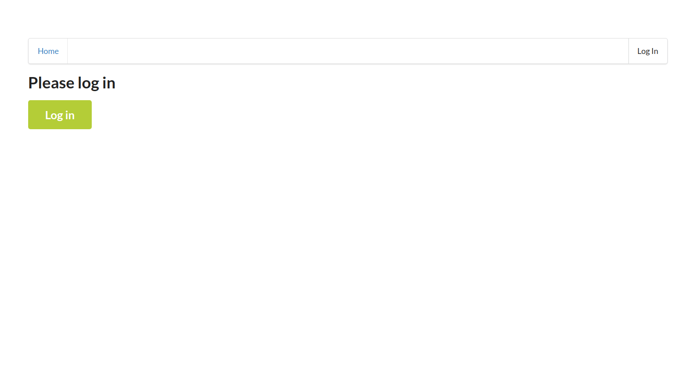
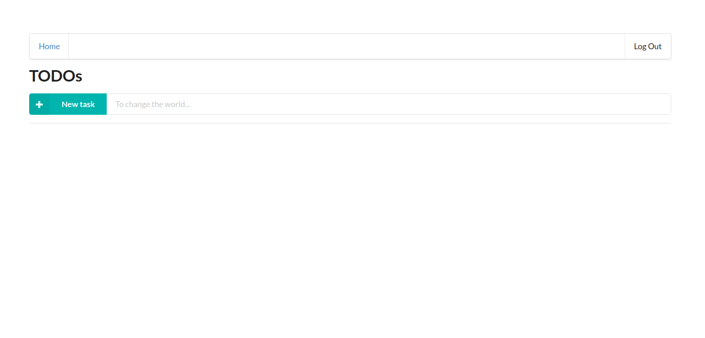
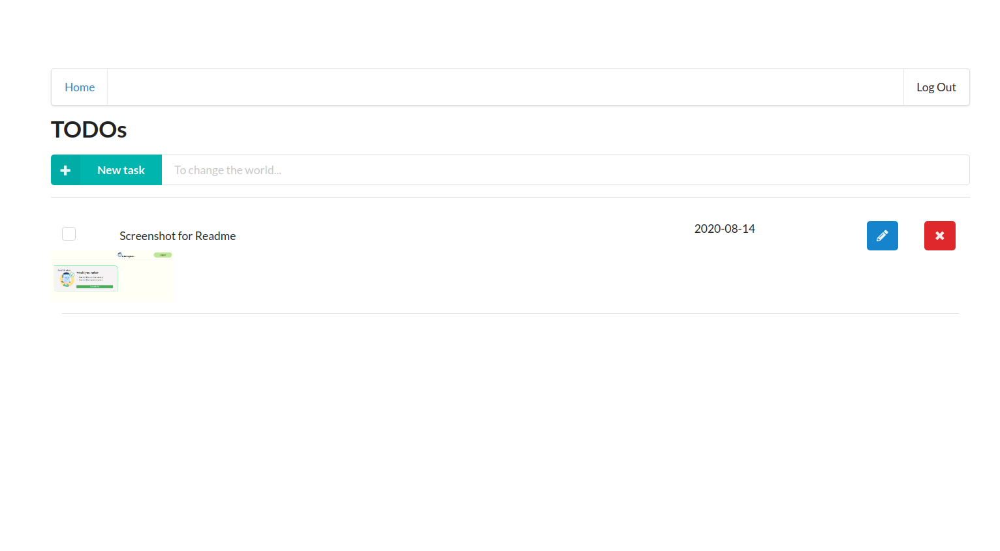

# Serverless TODO

The frontend is using React to render the view.

The backend is fully serverless running on AWS Lambda.

## Screenshots
Login Screen


Home Page


Todo Example


## Functionality of the application

The user can log in using their google login. More options can be added using the service Auth0. Frontend gets their todos from DynamoDB database by querying for the user id and their todos are viewed in their home page. The primary key here is the `userId` and the sort key is `todoId`. The fetch of items for the same user needs to be very fast and that is the reason I chose user id but not the todo id as my primary key.

The user can create, edit, delete todos. Each request is needs to be authrozied to invoke the functions.

The functions have their own permissions set in the serverless.yaml to make them accountable and limit their responsibility only to what they do.

The requests are validated in the API GATEWAY using json schemas. This required a serverless plugin until lately, `serverless-reqvalidator-plugin`, which is no longer needed and instead serverless framework takes care of it. Only valid requests hit the lambda functions, I implemented this as a cost saving measure.

The user can also add image to each todo. To grant access to S3 upload I have used presignedurl's so the user is given one time expiring access to todoid.png local in S3 bucket with each upload, post, request.

## The functions

- Auth - The auth function runs to make sure the user has is authorized to run the lambda function. This is configured through serverless framework via the serverless.yml.
- GetTodos - Fetches all todos for the user, using their user id from the auth token.
- CreateTodo - Creates a todo item in the DynamoDB database.
- UpdateTodo - Updates the todo item fields in the DynamodDB database.
- DeleteTodo - Deletes the todo item in the DynamoDB databse.
- GenerateUploadUrl - Generates a presigned url for user to upload to s3 bucket destination. This function has the privildge to upload to s3, so it can grant that priviledge to the user for a limited time.

## Additionaly Considerations

### Making Cloud Provider Independent

I have separated the business logic and data layer in their separate modules in order to make the app portable. If we want to port the app to Microsoft Azure, we only need to change the data layer and in business logic module we instantiate our class once and can use the api specific methods to do our work.

### Xray and logging

In order to debug issues I have implemented logging and Xray to make it easier to identify bottlenecks in the architecture.

### Dealing with Cold Start

In order to reduce the cold start time since my app is not used frequently, I have implemented the `serverless-plugin-warmup` for each function.

### Canary Deployment

In order to deploy the updates gradually I configured the createTodo function for 10%, per minute intervals. This allows my app to have 0 downtime with updates rolling out. I just implemented it for one function, as this project is learning/portfolio oriented.

### Express Refactor

In order to learn how to refactor an existing project using express to serverless lambda, I have used `serverless-http` module, I have implemented it to getTodos function. You can check the code if you want to see how. I have also left the old implementation as comments so you can see the changes I made at one place.

## How to run the project locally

Run `git clone https://github.com/frank3stein/serverless.git`
then `cd serverless/client && npm install && npm start` to install dependencies and start the local server.
The server will be running at `localhost:3000`

```bash
git clone https://github.com/frank3stein/serverless.git
cd serverless/client
npm install
npm start
```

If you can not login make sure that in
`client/src/config.ts`
authConfig.callbackUrl points to `http://localhost:3000/callback`.
